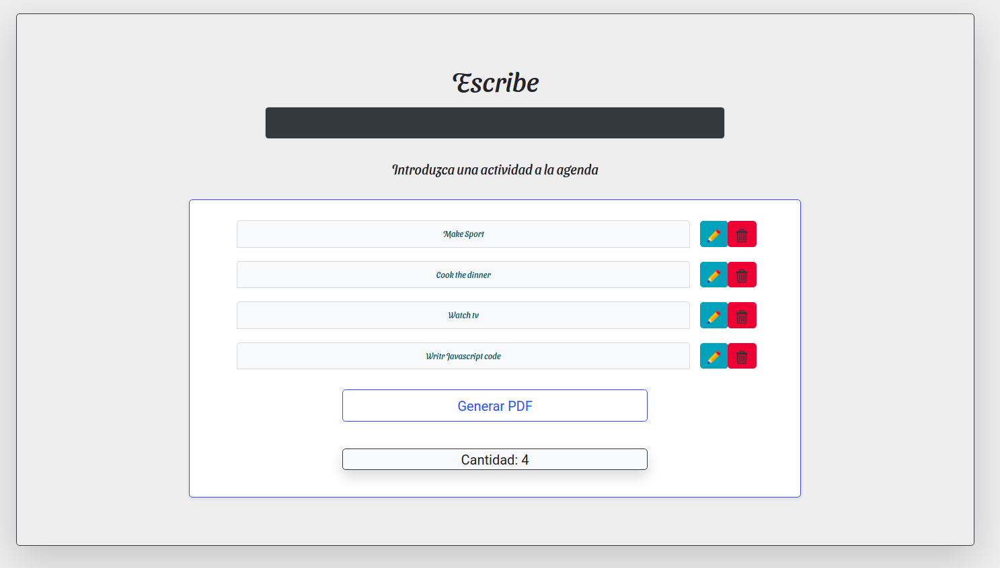

##Application TO-DO  by Userlg

--------------------------------

###Requires and Installation

*Vuejs Cdn

*JSPDF

*Bootstrap

*Liver Server

---------------------

Code for Show

###App.js
~~~
var app = new Vue({
  el: "#app",
  data: {
    newElement: "",
    element: [
      { tarea: "Make Sport", completed: true },
      { tarea: "Cook the dinner", completed: true },
      { tarea: "Watch tv", completed: false },
      { tarea: "Writr Javascript code", completed: true },
    ],
  },

~~~

###App.js - JSPDF

~~~
  exportPDF() {
      var vm = this.element;
      var columns = [
        { title: "Tarea", dataKey: "tarea" },
        { title: "Completada", dataKey: "completed" },
      ];
      var doc = new jsPDF("p", "pt");
      // doc.text("Lista de actividades", 40, 40);
      doc.autoTable(columns, vm);
      doc.save("file.pdf");
    },
~~~

--------------

#Preview

[repository][(https://github.com/userlg/)]

          

